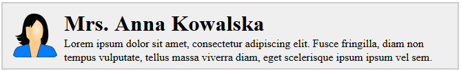

# Zagnieżdżanie &ndash; zadania

### Przygotowanie

> Stwórz w pełni działające środowisko, które pozwoli Ci pisać pliki JSX, skompilować je do plików JS i uruchomić działającą aplikację React.
> 
> Pamiętaj o:
> - ```npm init```
> - Zainstalowaniu odpowiednich modułów
> - Ustawieniu Webpacka, pierwszym plikiem wejściowym ma być `js/zadanie00.jsx` (potem z kolejnymi numerami zadań), wyjściowym zawsze `js/out.js`
>
> **Pamiętaj, żeby podczas wykonywania zadań modyfikować odpowiednio plik _webpack.config.js_, aby wskazywać plik nad któym obecnie pracujesz w _entry_.**

## Zadanie rozwiązywane z wykładowcą

### Budowanie listy osób  (~ 10min)

W pliku `js/zadanie00_02.js` znajduje się tablica z obiektami reprezentującymi osobę. Zaimportuj ją do pliku `js/zadanie00.jsx` np. za pomocą:

```import people from './zadanie00_02';```

Używając metody ```.map()``` tablicy stwórz z tablicy elementy ```div``` zawierające imię i nazwisko danej osoby. Nazwy tych właściwości obiektu znajdziesz w importowanym pliku. 

Następnie za pomocą React wyrenderuj w elemencie o id ```app``` element ```div```, w którym będzie się wyświetlały wszystkie wygenerowane elementy ```div```.

## Zadania do samodzielnego wykonania

### Zadanie 1  (~ 10min - 15min)
#### Import danych i tworzenie struktury

W pliku `js/zadanie01.js` znajduje się obiekt reprezentujący osobę. Zaimportuj go do pliku `js/zadanie01.jsx` np. za pomocą:

```import person from './zadanie01';```

Przerób zadanie 2 z wyrażeń tak, aby powstała następująca struktura:

```HTML
<div>
    <h1>{ tytuł + imię + nazwisko }</h1>
    <span>{ wiek }</span>
</div>
```

Za pomocą React wyrenderuj w elemencie o id ```app``` element ```div```, w którym będzie się wyświetlał tytuł, imię, nazwisko oraz wiek tej osoby według struktury podanej powyżej. Nazwy tych właściwości obiektu znajdziesz w importowanym pliku. 

### Zadanie 2  (~ 15min - 20min)
####  Zmiana struktury

W pliku `js/zadanie00_02.js` znajduje się tablica z obiektami reprezentującymi osobę. Zaimportuj ją do pliku `js/app.jsx` np. za pomocą:

```import people from './zadanie00_02';```

Przerób zadanie z wykładowcą w taki sposób, żeby powstała następująca struktura:
```HTML
<div class="person">
    
    <div class="info">
        <h1>{ tytuł + imię + nazwisko }</h1>
        <p>{ bio }</p>
    </div>
</div>
 ```
 
 Powyższy kod jest jedynie podglądowy. **Pamiętaj w jaki sposób powinna być przekazywana nazwa klasy CSS w tagach JSX oraz o odpowiednich zamknięciach znaczników.**
 
 Nazwy tych właściwości obiektu znajdziesz w importowanym pliku. 
 
 Efektem powinny być elementy podobne do tego:
 

Następnie za pomocą React wyrenderuj w elemencie o id ```app``` element ```div```, w którym będą się wyświetlały wszystkie wygenerowane elementy ```div```.
