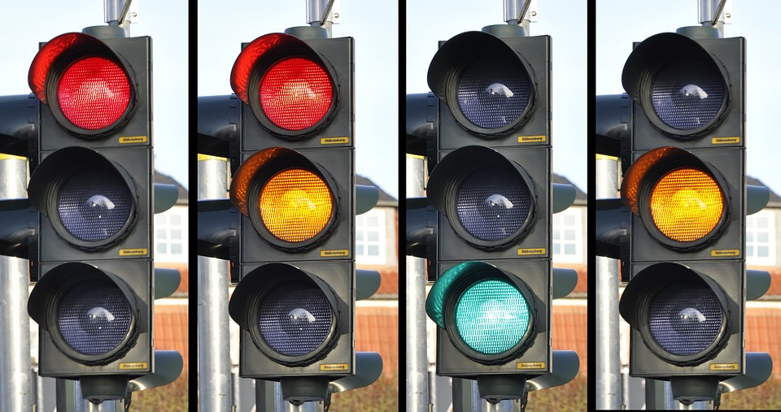

# Dzień 3 &ndash; zadania domowe

### Przygotowanie

> Stwórz w pełni działające środowisko, które pozwoli Ci pisać pliki JSX, skompilować je do plików JS i uruchomić działającą aplikację React.
> 
> Pamiętaj o:
> - ```npm init```
> - Zainstalowaniu odpowiednich modułów
> - Ustawieniu Webpacka, pierwszym plikiem wejściowym ma być `js/zadanie01.jsx` (potem z kolejnymi numerami zadań), wyjściowym zawsze `js/out.js`
>
> **Pamiętaj, żeby podczas wykonywania zadań modyfikować odpowiednio plik _webpack.config.js_, aby wskazywać plik nad którym obecnie pracujesz w _entry_.**

### Zadanie 1

W pliku `js/zadanie01.jsx` znajduje się komponent `UpperCaseText` służący do zmiany liter na wielkie.

Jest on napisany w sposób funkcyjny. Przepisz go oraz komponent `App` na działające klasy ES6. 

### Zadanie 2

Stwórz komponent `AnotherColor`, który przechowuje kolor do wyświetlenia jako **stan lokalny**. Niech kolor będzie domyślnie nastawiony na "yellow".

Komponent ma wyrenderować ten element `div`, z tłem ustawionym na ten ze stanu lokalnego.

Dodaj timer do swojego komponentu, który po 5 sekundach zmieni ten kolor na "blue". **Pamiętaj, aby zrobić to w odpowiedniej metodzie cyklu życia, pamiętaj aby zwolnić zasoby.**

Dodaj `console.log` do każdej metody cyklu życia.

Zrenderuj swój komponent.

Zajrzyj do konsoli. Które metody cyklu życia zostały wywołane, dlaczego? Widzisz różnicę w porównaniu z wielokrotnym użyciem `ReactDOM.render()`?

**Pamiętaj, aby zbudować jeszcze główny komponent `App`, a w nim wykorzystywać komponenty budowane w ćwiczeniach. Renderuj na stronie główny komponent `App`.**

### Zadanie 3

Stwórz komponent o nazwie `TrafiicLights`. Przechowuje on w stanie lokalnym numer światła do wyświetlenia od 1 do 4. Domyślnie jest to 1. Do `props` przyjmuje wartości:
 - `redTime` (długość z jaką ma się wyświetlać pierwsze światło - czerwone - w sekundach);
 - `yellowTime` (długość z jaką ma się wyświetlać drugie i czwarte światło - czerwone/żółte oraz samo żółte - w sekundach);
 - `greenTime` (długość z jaką ma się wyświetlać trzecie światło - zielone - w sekundach).

Komponent powinien wyświetlać w elemencie `div` trzy kolejne `div`-y z wysokością i szerokością ustawioną na 100px i `border-radius` ustawionym na 50%. W zależności od tego, które światło powinno świecić każdy z trzech wewnętrznych elementów `div` ma tło albo czarne (wyłączone) albo o odpowiednim kolorze (włączone, poniżej kolory).

Światła powinny działać w następujący sposób i w takiej kolejności:

 
 
 Dodaj odpowiednie timery / interval do swojego komponentu, który po ilości sekund określonych w props zmieni odpowiednie światło, zgodnie z kolejnością. **Pamiętaj, aby zrobić to w odpowiedniej metodzie cyklu życia, pamiętaj aby zwolnić zasoby.**

Wyrenderuj swój komponent na stronie podając w atrybutach do props przykład

**Pamiętaj, aby zbudować jeszcze główny komponent `App`, a w nim wykorzystywać komponenty budowane w ćwiczeniach. Renderuj na stronie główny komponent `App`.**

### Zadanie 4

Stwórz dwa komponenty.

Pierwszy z nich `PropsToState` ma przyjmować w `props` wartość `text` i przechowywać ją w stanie lokalnym.
 
Drugi komponent `ShowInfo` przyjmuje po prostu w `props` wartość `info` i renderuje ją w elemencie `h1`.

`PropsToState` renderuje w swoim środku komponent `ShowInfo` przekazując mu ze stanu lokalnego wartość `text`.

Dodaj odpowiedni interval do swojego komponentu `PropsToState`, który co 1 sekundę dodaje do stanu lokalnego `text` jedną kropkę ".". **Pamiętaj, aby zrobić to w odpowiedniej metodzie cyklu życia, pamiętaj aby zwolnić zasoby.**

Zrenderuj swój komponent. Sprawdź w React Deveoper Tools co jest odświeżane - dlaczego?

**Pamiętaj, aby zbudować jeszcze główny komponent `App`, a w nim wykorzystywać komponenty budowane w ćwiczeniach. Renderuj na stronie główny komponent `App`.**